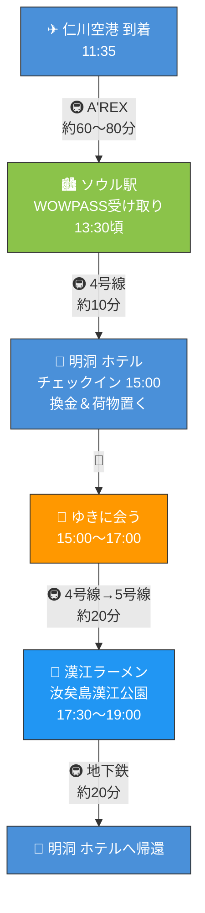
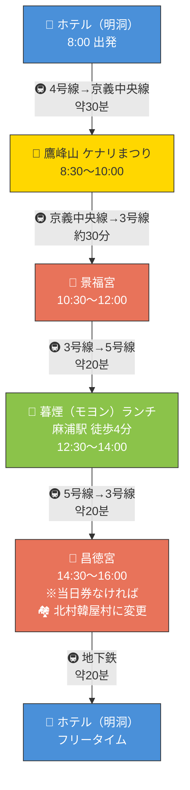
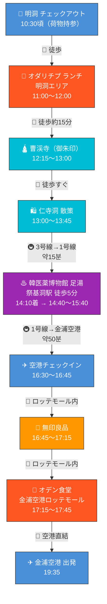

# 回遊ルート図

## 1日目 3/26（木）到着〜漢江ラーメン

```mermaid
flowchart TD
    A1["✈ 仁川空港 到着\n11:35"] -->|"🚇 A'REX\n約60〜80分"| A2

    A2["🏙️ ソウル駅\nWOWPASS受け取り\n13:30頃"] -->|"🚇 4号線\n約10分"| A3

    A3["🏨 明洞 ホテル\nチェックイン 15:00\n換金＆荷物置く"] -->|"👫"| A4

    A4["👫 ゆきに会う\n15:00〜17:00"] -->|"🚇 4号線→5号線\n約20分"| A5

    A5["🍜 漢江ラーメン\n汝矣島漢江公園\n17:30〜19:00"] -->|"🚇 地下鉄\n約20分"| A6

    A6["🏨 明洞 ホテルへ帰還"]

    style A1 fill:#4A90D9,color:#fff,stroke:#333
    style A2 fill:#8BC34A,color:#fff,stroke:#333
    style A3 fill:#4A90D9,color:#fff,stroke:#333
    style A4 fill:#FF9800,color:#fff,stroke:#333
    style A5 fill:#2196F3,color:#fff,stroke:#333
    style A6 fill:#4A90D9,color:#fff,stroke:#333
```

## 2日目 3/27（金）平日ゆったり観光

```mermaid
flowchart TD
    B1["🏨 ホテル（明洞）\n8:00 出発"] -->|"🚇 4号線→京義中央線\n약30분"| B2

    B2["🌼 鷹峰山 ケナリまつり\n8:30〜10:00"] -->|"🚇 京義中央線→3号線\n約30分"| B3

    B3["🏯 景福宮\n10:30〜12:00"] -->|"🚇 3号線→5号線\n약20분"| B4

    B4["🥩 暮煙（モヨン）ランチ\n麻浦駅 徒歩4分\n12:30〜14:00"] -->|"🚇 5号線→3号線\n약20분"| B5

    B5["🏯 昌徳宮\n14:30〜16:00\n※当日券なければ\n🏘️ 北村韓屋村に変更"] -->|"🚇 地下鉄\n약20분"| B6

    B6["🏨 ホテル（明洞）\nフリータイム"]

    style B1 fill:#4A90D9,color:#fff,stroke:#333
    style B2 fill:#FFD700,color:#333,stroke:#333
    style B3 fill:#E8735A,color:#fff,stroke:#333
    style B4 fill:#8BC34A,color:#fff,stroke:#333
    style B5 fill:#E8735A,color:#fff,stroke:#333
    style B6 fill:#4A90D9,color:#fff,stroke:#333
```

## 3日目 3/28（土）観光→帰国（東→西へ一直線）

```mermaid
flowchart TD
    C1["🏨 明洞 チェックアウト\n10:30頃（荷物持参）"] -->|"🚶 徒歩"| C2

    C2["🍲 オダリチプ ランチ\n明洞エリア\n11:00〜12:00"] -->|"🚶 徒歩約15分"| C3

    C3["🛕 曹渓寺（御朱印）\n12:15〜13:00"] -->|"🚶 徒歩すぐ"| C4

    C4["🛍️ 仁寺洞 散策\n13:00〜13:45"] -->|"🚇 3号線→1号線\n약15분"| C5

    C5["♨ 韓医薬博物館 足湯\n祭基洞駅 徒歩5分\n14:10着 → 14:40〜15:40"] -->|"🚇 1号線→金浦空港\n약50분"| C6

    C6["✈ 空港チェックイン\n16:30〜16:45"] -->|"🚶 ロッテモール内"| C7

    C7["🛒 無印良品\n16:45〜17:15"] -->|"🚶 ロッテモール内"| C8

    C8["🍲 オデン食堂\n金浦空港ロッテモール\n17:15〜17:45"] -->|"🚶 空港直結"| C9

    C9["✈ 金浦空港 出発\n19:35"]

    style C1 fill:#4A90D9,color:#fff,stroke:#333
    style C2 fill:#FF5722,color:#fff,stroke:#333
    style C3 fill:#00BCD4,color:#fff,stroke:#333
    style C4 fill:#00BCD4,color:#fff,stroke:#333
    style C5 fill:#9C27B0,color:#fff,stroke:#333
    style C6 fill:#4A90D9,color:#fff,stroke:#333
    style C7 fill:#FF9800,color:#fff,stroke:#333
    style C8 fill:#FF5722,color:#fff,stroke:#333
    style C9 fill:#4A90D9,color:#fff,stroke:#333
```
