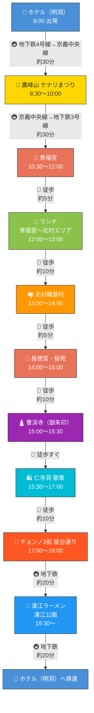

# 回遊ルート図

3/27（金）ソウル回遊ルート

```mermaid
flowchart TD
    A["🏨 ホテル（明洞）\n8:00 出発"] -->|"🚇 地下鉄4号線→京義中央線\n約30分"| B

    B["🌼 鷹峰山 ケナリまつり\n8:30〜10:00"] -->|"🚇 京義中央線→地下鉄3号線\n約30分"| C

    C["🏯 景福宮\n10:30〜12:00"] -->|"🚶 徒歩\n約5分"| D

    D["🍚 ランチ\n景福宮〜北村エリア\n12:00〜13:00"] -->|"🚶 徒歩\n約10分"| E

    E["🏘️ 北村韓屋村\n13:00〜14:00"] -->|"🚶 徒歩\n約5分"| F

    F["🏯 昌徳宮・秘苑\n14:00〜15:00"] -->|"🚶 徒歩\n約10分"| G

    G["🛕 曹渓寺（御朱印）\n15:00〜15:30"] -->|"🚶 徒歩すぐ"| H

    H["🛍️ 仁寺洞 散策\n15:30〜17:00"] -->|"🚶 徒歩\n約10分"| I

    I["🍢 チョンノ3街 屋台通り\n17:00〜19:00"] -->|"🚇 地下鉄\n約20分"| J

    J["🍜 漢江ラーメン\n漢江公園\n19:30〜"] -->|"🚇 地下鉄\n約20分"| K

    K["🏨 ホテル（明洞）へ帰還"]

    style A fill:#4A90D9,color:#fff,stroke:#333
    style B fill:#FFD700,color:#333,stroke:#333
    style C fill:#E8735A,color:#fff,stroke:#333
    style D fill:#8BC34A,color:#fff,stroke:#333
    style E fill:#FF9800,color:#fff,stroke:#333
    style F fill:#E8735A,color:#fff,stroke:#333
    style G fill:#9C27B0,color:#fff,stroke:#333
    style H fill:#00BCD4,color:#fff,stroke:#333
    style I fill:#FF5722,color:#fff,stroke:#333
    style J fill:#2196F3,color:#fff,stroke:#333
    style K fill:#4A90D9,color:#fff,stroke:#333
```
